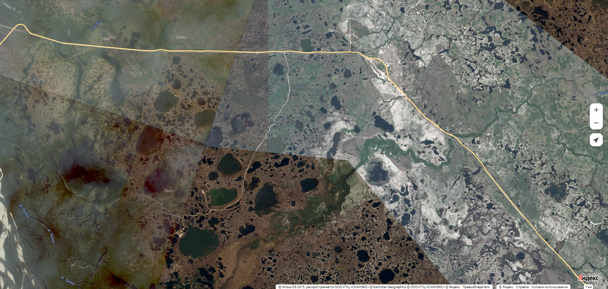
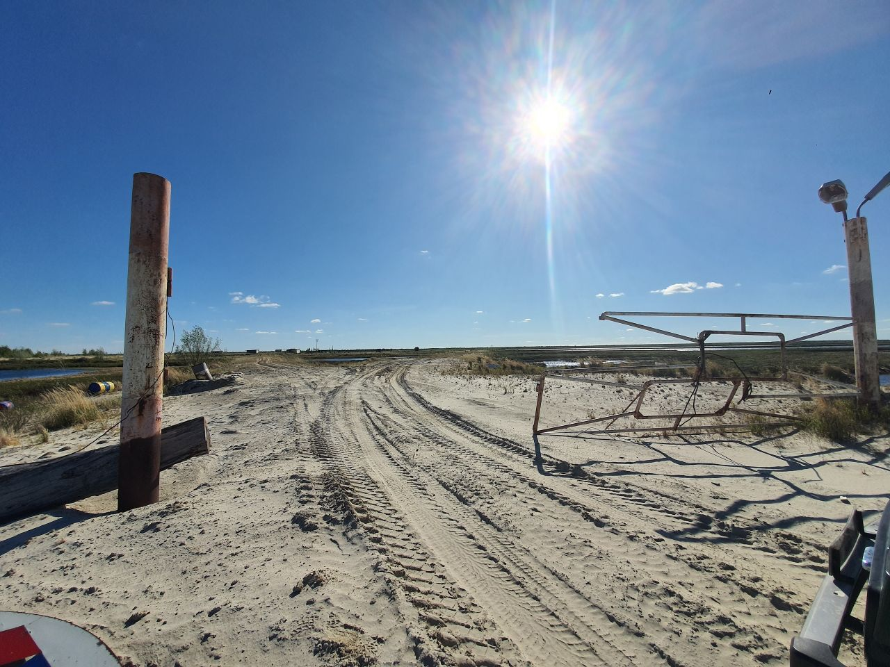

# Давным давно...

## Условие

Давным давно я работал на одном месторождении, то были мои лучшие годы. Эх, хорошо было там, помню как рыбу ловили дни напролёт и шашлыки жарили. Правда закрыли потом эту скважину. Всегда рассказываю про приключения своим внукам. Однажды они спросили: "Деда, а насколько глубокой была скважина эта?". А я и не помню.

Поможете мне вспомнить, уважаемый? Вот у меня тут фотки остались. Хм, дай-ка подумать, помню что-то про **фонд гео...** чё-то там, который помнит про всё такое, ну я думаю вы сообразите что, где и как.

Да прибудет с вами сила **Яндекса**!

Формат флага ```TulaCTF{123456789}```


где-то тут


моё любимое фото, недавно ездил туда вспомнить былое


## Решение

Краткое условие: есть фотка карты, есть фотка с места
необходимо найти глубину скважины. Есть две подсказски про "фонд гео..." и "яндекс".

`Замечание: найти это место можно только на картах **яндекса** и openstreetmap. GoogleMaps отказывается искать реки с фотографии спутников. Зато GoogleMaps имеют самый детальный снимок старого месторождения.`

Замечаем две речки на карте: Чирча и Тыяха. Идём в карты **яндекса**.
Для Тыяхи несколько вариантов. Для Чирчи всего 1. Понимаем, что всё это находится в Надымском районе Ямало-ненецкого автономного округа.

Судя по второй фотографии, там много песка и это болота. (тут должна быть подсказка про путешествие). На первой фотографии видно два ответвления. Верхнее не подходит, т.к. там лес, а у нас его нет на фотографии. Делаем вывод, что нас интересует дорожка из песка вниз.

Если присмотреться, то это похоже на какой-то КПП: ворота, лампы освещения и кусочек бампера машины. Если быть сверхточным, то координаты ворот 65.50461311492536, 72.96590488449884. (Гляньте на GoogleMaps, там получше видно)

Далее ищем в **яндексе** что-то про старые месторождения, что-то рядом с Надымом, какой-нибудь реестр, карту и т.д. Натыкаемся на "Единый фонд геологической информации о недрах" (https://efgi.ru/). Открываем карту, ищем ту же самую точку, которую мы нашли.

Находим вот этот объект на карте https://efgi.ru/object/17590942. Это, так называемая, "Надымская (Южно-Надымская) 2 поисковая" скважина. Вбиваем это название в поисковик **яндекса**. 

Практически первой строкой получаем сайт "Керн ВНИГНИ" (https://kern.vnigni.ru/well/catalog/63920c3c-6719-482d-90a0-e5ea3dcecbae), на котором хранятся сведенья о всех недрах, в том числе и об этой скважине. Смотрим глубину, 4082 метра.

`*Так же можно было заметить, что на сайте единого фонда есть графа "Сведения об организации, осуществляющей хранение и предоставление информации о недрах от имени правообладателя", в которой указан ВНИГНИ.*`

Если вы нашли другой путь, буду рад услышать ваш ход мыслей.

## Flag ```TulaCTF{4082}```


## Подсказка 1
Кхм, яндекс всемогущ, только он может вам помочь!

## Подсказка 2
Я вспомнил! "Единый фонд геологической информации о недрах", во!

## Подсказка 3
Было ещё слово умное какое-то на бумажках, когда мы помогали собирать образцы пород для г... гну, гни, в.. а! Точно, ВНИГНИ!

